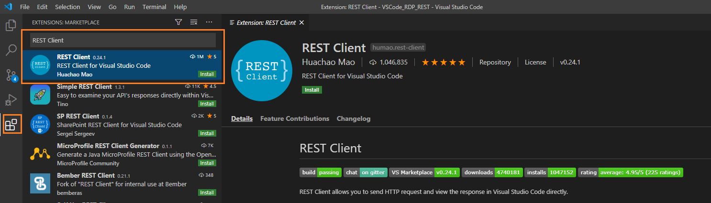
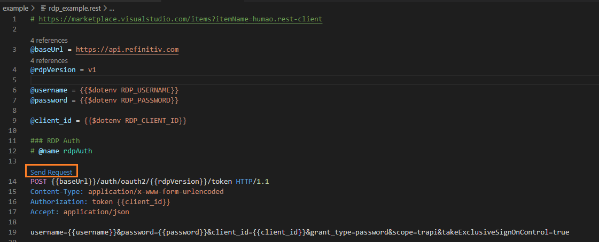
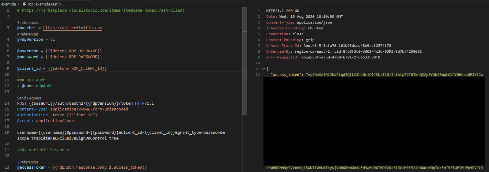
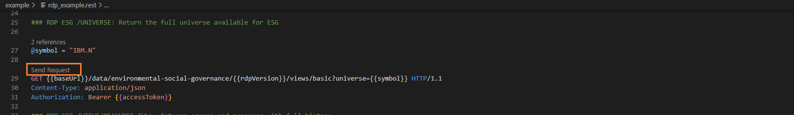
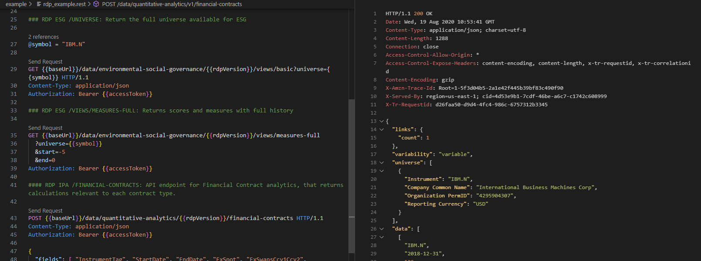
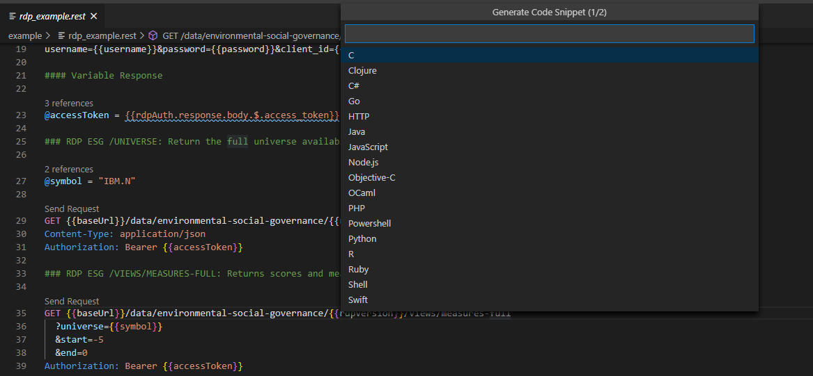

# How to use Visual Studio Code - REST Client extensions to request RDP APIs content
- version: 1.0
- Last update: August 2020
- Environment: Windows
- Prerequisite: [Access to RDP credentials](#prerequisite) and [Visual Studio Code](https://code.visualstudio.com/)

## <a id="intro"></a>Introduction

[Visual Studio Code](https://code.visualstudio.com/) (or just VSCode) is a free source code editor developed and maintained by [Microsoft](https://github.com/Microsoft/vscode). This cross-platform editor took over developers popularity based on it fast and lightweight, supports variety of programming languages with IntelliSense (a feature that borrows from its sibling, Visual Studio IDE) and supports a complete development operations like debugging, task running and version control. 

VSCode also supports a lot of extensions which extends the editor features and development workflow such as code linters or add new language support, etc. One of the most recent  extension is [REST Client](https://marketplace.visualstudio.com/items?itemName=humao.rest-client) allows developers send HTTP request and view the response message in VSCode directly.

This article demonstrates how to use the REST Client extension in VSCode by using [Refinitiv Data Platform (RDP) APIs](https://developers.refinitiv.com/refinitiv-data-platform/refinitiv-data-platform-apis) as an example HTTP REST API. Developers who currently use VSCode implement the RDP APIs application (with any languages) can use this extension to test the RDP APIs query, endpoint without switch to other tools like [Postman](https://www.postman.com/) or [cURL](https://curl.haxx.se/).

Note: RDP APIs developers are still need [RDP APIs Playground page](https://api.refinitiv.com) to get the APIs document and information.

## <a id="whatis_rdp"></a>What is Refinitiv Data Platform (RDP) APIs?

The [Refinitiv Data Platform (RDP) APIs](https://developers.refinitiv.com/refinitiv-data-platform/refinitiv-data-platform-apis) provide various Refinitiv data and content for developers via easy to use Web base API.

 RDP APIs give developers seamless and holistic access to all of Refinitiv content such as Historical Pricing, Environmental Social and Governance (ESG), News, Research, etc and commingled with their own content, enriching, integrating and distributing the data through a single interface, delivered wherever they need it.  The RDP APIs delivery mechanisms are following:
* Request - Response: RESTful web service (HTTP GET, POST, PUT or DELETE) 
* Alert: delivery is a mechanism to receive asynchronous updates (alerts) to a subscription. 
* Bulks:  deliver substantial payloads, like the end of day pricing data for the whole venue. 
* Streaming: deliver real-time delivery of messages.

This article is focusing on the Request - Response: RESTful web service delivery method only. 

For more detail regarding Refinitiv Data Platform, please see the [Quick Start](https://developers.refinitiv.com/refinitiv-data-platform/refinitiv-data-platform-apis/quick-start) and [Tutorials](https://developers.refinitiv.com/refinitiv-data-platform/refinitiv-data-platform-apis/learning) pages.

### <a id="rdp_workflow"></a>RDP APIs Application Workflow

Refinitiv Data Platform entitlement check is based on OAuth 2.0 specification. The first step of an application work flow is to get a token from RDP Auth Service, which will allow access to the protected resource, i.e. data REST API's. 

Next, after the application received the Access Token (an authorization token) from RDP Auth Service, all subsequent REST API calls will use this token to get the data. The application needs to input Access Token via *Authorization* HTTP request message header as shown below. 
- Header: 
    * Authorization = ```Bearer <RDP Access Token>```

Please notice *the space* between the ```Bearer``` and ```RDP Access Token``` values.

Please find more detail regarding RDP APIs workflow in [Introduction to the Request-Response API page](https://developers.refinitiv.com/refinitiv-data-platform/refinitiv-data-platform-apis/learning?content=38560&type=learning_material_item).

## <a id="restclient_syntax"></a>VSCode REST Client Syntax

The REST Client plugin requires just a plain text file with extension ```.http``` or ```.rest```. The basic syntax is very simple as following

```
### Request 1
[GET|POST] [REST API URL] # Request Line
[Request Headers]

[Request Body]

### Request 2
[GET|POST] [REST API URL]
[Request Headers]

[Request Body]

```

The file can contain multiple requests, each request is separated by ```###``` delimiter (three or more consecutive ```#```). 

### <a id="request_line"></a>Request Line

The first line of request is the *Request Line*. It contains the request method (*GET* or *POST*), a space and then follow by the API url endpoint.

Examples

```
### RDP historical-pricing: retrieve time series pricing Interday summaries data

GET https://api.refinitiv.com/data/historical-pricing/v1/views/interday-summaries/FB.O HTTP/1.1
```

or

```
GET https://api.refinitiv.com/data/historical-pricing/v1/views/interday-summaries/FB.O 
```

or

```
### RDP Auth Service

POST https://api.refinitiv.com/auth/oauth2/v1/token HTTP/1.1
```

### <a id="query"></a>Request Line: Query Parameters

You can set the API query parameters into API URL directly as following:

```
### RDP News Service: Get News Headlines

GET https://api.refinitiv.com/data/news/v1/headlines?query="USA"
```

If the request contains multiple parameters, you can split it to multiple lines. The REST Client extensions parse the lines in immediately after the Request Line which starts with ```?``` and ```&``` operations.

```
### RDP ESG /VIEWS/MEASURES-FULL: Returns scores and measures with full history

GET https://api.refinitiv.com/data/environmental-social-governance/v1/views/measures-full
  ?universe=FB.O
  &start=-5
  &end=0 
```

### <a id="request_header"></a>Request Header

The lines immediately after the *Request Line* are *Request Header*. The supported syntax is ```field-name: field-value``` format, each line represents one header. The Authentication also can be set in this Request Header section.

```
### RDP ESG /UNIVERSE: Return the full universe available for ESG

GET https://api.refinitiv.com/data/environmental-social-governance/v1/views/basic?universe=IBM.N HTTP/1.1
Content-Type: application/json
Authorization: Bearer <access_token>
```

### <a id="variables"></a>Variables

You can declare you own File variables to keep the values and reuse them in the script such as API base endpoint, version with ```@variableName = variableValue``` syntax in a separate line from request block. Then the request can use the defined variable with ```{{variableName}}``` syntax. Please note that you *do not* need the ```""``` or ```''``` characters for a string value.

Example:
```

@baseUrl = https://api.refinitiv.com
@rdpVersion = v1

###

POST {{baseUrl}}/auth/oauth2/{{rdpVersion}}/token HTTP/1.1

### 

@symbol = "IBM.N"

GET {{baseUrl}}/data/environmental-social-governance/{{rdpVersion}}/views/basic?universe={{symbol}}
```

The extension will parse the above Request Lines to ```https://api.refinitiv.com/auth/oauth2/v1/token``` and ```https://api.refinitiv.com/data/environmental-social-governance/v1/views/basic?universe=IBM.N``` endpoints. 

Note: the variable name **must not** contain any spaces.

### <a id="request variable"></a>Variables: Request Variables

You can declare *Request Variables* to get a request or response message content. The syntax is just ```# @name requestName``` on a line before the Request Line. Once the request is sent, the script can access response (or request) message information from ```{{requestName.(response|request).(body|headers).(*|JSONPath|XPath|Header Name)}}``` syntax. 

This feature is mandatory for RDP APIs because the consumer needs to get a token from RDP Auth Service first, then use that token to request further protected resource from the platform. 

```
### RDP Auth Service
# @name rdpAuth

POST {{baseUrl}}/auth/oauth2/{{rdpVersion}}/token HTTP/1.1
Content-Type: application/x-www-form-urlencoded
Authorization: token {{client_id}}
Accept: application/json

username={{username}}&password={{password}}&client_id={{client_id}}&grant_type=password&scope=trapi&takeExclusiveSignOnControl=true

#### Variable Response

@accessToken = {{rdpAuth.response.body.$.access_token}}

### RDP ESG /UNIVERSE: Return the full universe available for ESG

@symbol = "IBM.N"

GET {{baseUrl}}/data/environmental-social-governance/{{rdpVersion}}/views/basic?universe={{symbol}} HTTP/1.1
Content-Type: application/json
Authorization: Bearer {{accessToken}}
```

The example above named RDP Auth Service request with **rdpAuth** name, then gets access token from ```{{rdpAuth.response.body.$.access_token}}``` command and set it to  variable name **accessToken**. Then set this set this access token to the request message Authentication in all subsequent RDP APIs requests with ```Authorization: Bearer {{accessToken}}``` Request header syntax.

For the full detail and explanation of RDP Authentication process application workflow, please refer to the following RDP APIS tutorials:
- [Introduction to the Request-Response API](https://developers.refinitiv.com/requestresponse-apis/learning?content=38560&type=learning_material_item).
- [Authorization - All about tokens](https://developers.refinitiv.com/refinitiv-data-platform/refinitiv-data-platform-apis/learning?content=38562&type=learning_material_item).

### <a id="request_body"></a>Request Body

The *Request Body* can be set by adding a *blank line* after Request Header and then place your HTTP request data in the next line. The request data can be various type of format such as JSON, XML or key-value tuples.

One example is the RDP Auth Service which use **application/x-www-form-urlencoded** Content-Type. This content-type uses key-value tuples separated by ```&```, with a ```=``` between the key and the value.

```
### RDP Auth Service

# @name rdpAuth

POST {{baseUrl}}/auth/oauth2/{{rdpVersion}}/token HTTP/1.1
Content-Type: application/x-www-form-urlencoded
Authorization: token {{client_id}}
Accept: application/json

username={{username}}&password={{password}}&client_id={{client_id}}&grant_type=password&scope=trapi&takeExclusiveSignOnControl=true
```

Example for **application/json** Content-Type:
```
### RDP IPA /FINANCIAL-CONTRACTS: API endpoint for Financial Contract analytics, that returns calculations relevant to each contract type.

POST {{baseUrl}}/data/quantitative-analytics/{{rdpVersion}}/financial-contracts HTTP/1.1
Content-Type: application/json
Authorization: Bearer {{accessToken}}

{
  "fields": [ "InstrumentTag", "StartDate", "EndDate", "FxSpot", "FxSwapsCcy1Ccy2", "FxOutrightCcy1Ccy2" ],
  "outputs": [ "Data", "Headers" ],
  "universe": [
    {
      "instrumentType": "FxCross",
      "instrumentDefinition": {
        "instrumentTag": "FX_deal_001",
        "fxCrossType": "FxForward",
        "fxCrossCode": "EURGBP",
        "legs": [ { "tenor": "3M10D" } ]
      },
      "pricingParameters": {
        "valuationDate": "2019-02-02T00:00:00Z",
        "priceSide": "Mid"
      }
    }
  ]
}
```

For more detail regarding the REST Client extension syntax and features, please see the [VSCode: REST Client product page](https://marketplace.visualstudio.com/items?itemName=humao.rest-client).

## <a id="prerequisite"></a>Demo Applications Prerequisite
This demo project requires the following dependencies software.
1. RDP Access credentials.
2. [Visual Studio Code](https://code.visualstudio.com/) editor.
3. [VSCode: REST Client](https://marketplace.visualstudio.com/items?itemName=humao.rest-client) extension.
4. Internet connection.

Please contact your Refinitiv's representative to help you to access Refinitiv Data Platform credentials. You can generate/manage the AppKey from [AppKeyGenerator web site](https://emea1.apps.cp.thomsonreuters.com/apps/AppkeyGenerator) or AppKey Generator tool in Eikon Desktop/Refinitiv Workspace application. Other useful document to help developers get start with RDP account is [Getting Start with Refinitiv Data Platform article](https://developers.refinitiv.com/article/getting-start-refinitiv-data-platform).

## <a id="setup"></a>VSCode REST Client and Project Setup

Once you have have unzipped or downloaded the example project folder into a directory of your choice, you can setup the VSCode REST Client extension and project prerequisite by the following steps.

Firstly, open VSCode and click ```Extensions``` button, then search the **REST Client** extension and click install it.

 

Next, create a file name ```.env``` in the ```example``` folder and input your RDP credentials with the following message format.

```
RDP_USERNAME=<your RDP username>
RDP_PASSWORD=<your RDP password>
RDP_CLIENT_ID=<your RDP client id/app key>
```

Please note that you *do not* need the ```""``` or ```''``` characters for a string value as the following example:

```
RDP_USERNAME=example@email.com
RDP_PASSWORD=$$example_password%%
RDP_CLIENT_ID=bbb_example_client_id_ccc
```

Now the VSCode editor is ready to request data from RDP REST APIs.

## <a id="how_to_run"></a>How to run the example

Once you have completed setup VSCode and ```.env``` file, open the ```rdp_example.rest``` in file*example* folder  with VSCode editor. Then click the ```Send Request``` link above the request or use shortcut Ctrl+Alt+R (Cmd+Alt+R for macOS) to send the HTTP request message. For RDP APIs, the first request message is always authentication request message.

 

The HTTP response message will show in a separate webview panel of VSCode editor.

 

Once the rdp_example.rest file receives RDP Auth Service response message, it keeps RDP access token to the script variable via ```@accessToken = {{rdpAuth.response.body.$.access_token}}``` command. Then you can request further RDP content in rdp_example.rest file.

 

Then get the response.

 

You can also select interested HTTP request and generate the source code for that request in various programming language by shortcut Ctrl+Alt+C (Cmd+Alt+C for macOS).

 


## <a id="conclusion"></a>Conclusion

You may think "why would I bother use this extension when I already have a Postman". The Postman is a complete platform for API testing and development so it has much more features then this extension. However, this VSCode: REST Client extension lets developers who are using this editor do a quick REST API test call such as test various API query parameters, test new Service URL or test different credentials *in the same tool that they are developing the application*. Developers do not need to switch a tool for a quick REST API query test anymore. 

This extension helps RDP APIs developers (either who use the REST API directly or [RDP Libraries](https://developers.refinitiv.com/refinitiv-data-platform/refinitiv-data-platform-libraries)) with Visual Studio Code to implement application a smooth and seamless workflow.


## <a id="references"></a>References
For further details, please check out the following resources:
* [Refinitiv Data Platform APIs page](https://developers.refinitiv.com/refinitiv-data-platform).
* [Refinitiv Data Platform APIs Playground page](https://api.refinitiv.com).
* [Visual Studio Code product page](https://code.visualstudio.com/)
* [VSCode: REST Client product page](https://marketplace.visualstudio.com/items?itemName=humao.rest-client) and [GitHub](https://github.com/Huachao/vscode-restclient).

For any question related to Refinitiv Data Platform, please use the Developers Community [Q&A Forum](https://community.developers.refinitiv.com/spaces/231/index.html).